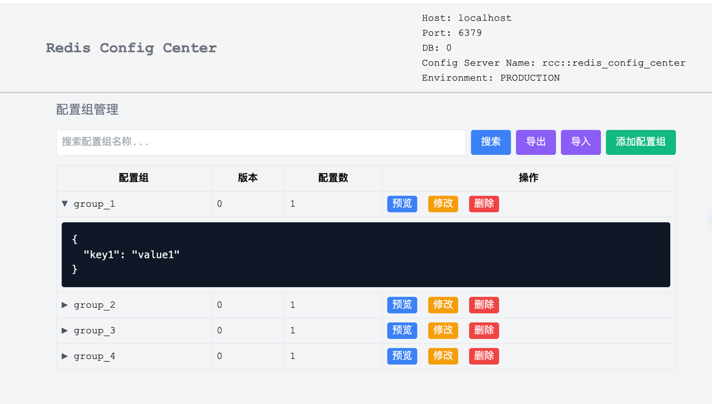
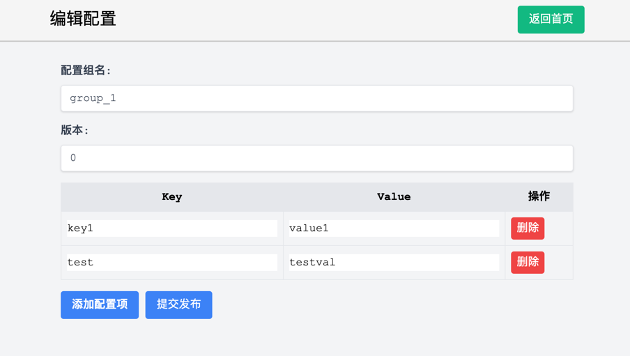
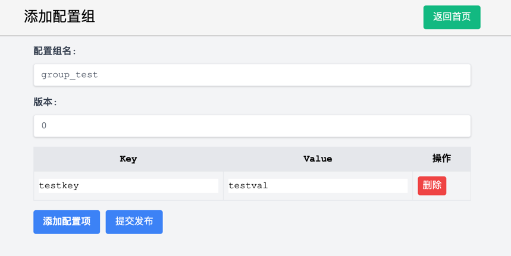
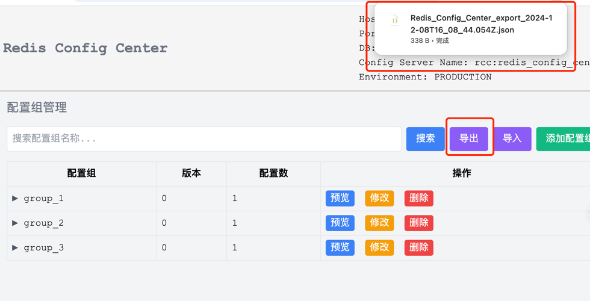
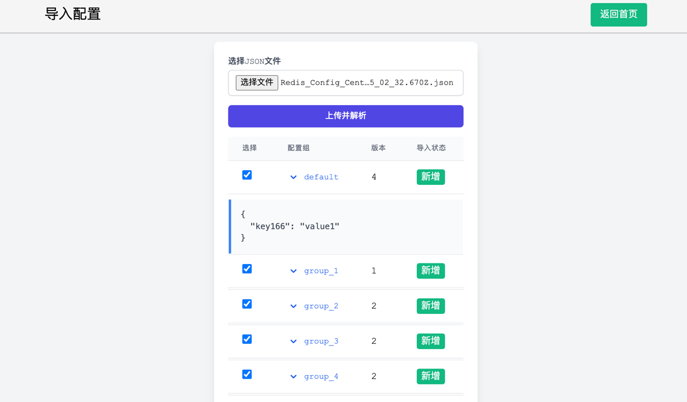

# Redis Config Center

[](https://github.com/yourusername/redis-config-center/releases)
[](https://www.python.org/)
[](https://opensource.org/licenses/Apache-2.0)

## 简介

Redis Config Center 是一个基于Redis实现的简易版配置中心，旨在均衡分配有限的配置组给集群的不同节点。它模仿了Nacos的设计理念，提供了配置的发布、自动更新，获取，配置组隔离等功能。当指定的配置组不存在时，能够根据当前节点的机器IP自动分配对应的配置组。

## 特性

- **配置管理**：通过Redis进行配置的存储和管理。
- **动态刷新**：客户端定时从服务器拉取最新的配置。
- **配置组隔离**：基于配置组隔离不同配置，可在环境变量中指定配置组。
- **IP路由/配置组动态分配**：当指定的配置组不存在或者被删除时，基于IP地址自动重新分配配置组，保证服务至少有一个配置组可用且无需重启。
- **可扩展性强**：核心实现为两个类 redis_config_server.py 与 redis_config_client.py 。代码仅100行左右，高可读性与可扩展性。
- **异步非阻塞**: python 协程实现，非阻塞。

## 安装与使用

### 安装依赖

首先安装项目依赖：

```bash
pip install -r requirements.txt
```

项目启动环境变量配置：
```python
# 必须配置：
import os
REDIS_URL = os.getenv("REDIS_URL", "localhost")
REDIS_PORT = int(os.getenv("REDIS_PORT", 6379))
REDIS_DB = int(os.getenv("REDIS_DB", 0))
REDIS_PASSWORD = os.getenv("REDIS_PASSWORD", None)

# 可选配置：
DEFAULT_CONFIG_GROUP = os.getenv("DEFAULT_CONFIG_GROUP", "default")
REDIS_CONFIG_CENTER_TYPE = os.getenv("REDIS_CONFIG_CENTER_TYPE", "PRODUCTION")

```


### 开始使用

#### 服务端：发布配置

基于 `redis_config_server.py` 发布配置：

```python
import asyncio
from redis_config_server import config_server, ConfigGroup

async def test():
    await config_server.insert_config_group(
        ConfigGroup(group_name="default", group_version=1, config_dict={"key1": "value1"}))
    # ... 插入其他配置组 ...
    
    print(await config_server.get_config_group("default"))
    # ... 获取其他配置组 ...

if __name__ == "__main__":
    asyncio.run(test())
```

#### 客户端：获取配置

基于 `redis_config_client.py` 启动配置中心客户端，并获取配置：

```python
import asyncio
from redis_config_client import config_client

async def test():
    await config_client.start()
    await asyncio.sleep(6)  # 等待足够的时间让配置刷新完成
    
    cur_config_group = config_client.get_config_group()
    test_val = config_client.get_config("test_key")
    
    print(f"客户端当前配置组信息为：{cur_config_group}")
    print(f"客户端当前配置'test_key'的值为：{test_val}")

if __name__ == "__main__":
    asyncio.run(test())

```

#### 客户端：集成FastAPI
```python
from contextlib import asynccontextmanager

import uvicorn
from fastapi import FastAPI
from redis_config_client import config_client

@asynccontextmanager
async def lifespan(app: FastAPI):
    await config_client.start()
    yield

app = FastAPI(lifespan=lifespan)

if __name__ == "__main__":
    uvicorn.run(app, host="0.0.0.0", port=8089)

```

*完整测试用例可参考：example/all_it.py*

## 服务端后台管理平台

我们同样提供了一个功能丰富的Web服务端配置管理平台，其代码位于`web`目录。可以通过直接运行`web/main.py`来启动应用，或者使用`deploy.sh`脚本将项目打包为Docker镜像，以便于部署和访问。
(该管理后台实现全部是基于redis_config_server.py)

### 核心功能

- **配置管理**：通过直观的Web界面轻松进行配置的发布、修改与删除。
- **数据迁移**：支持配置数据的导入、导出及迁移，确保数据操作的灵活性。
- **便捷部署**：提供Docker容器化选项，简化了跨环境部署流程。

### Web服务端快速启动

- **直接运行启动**：确保已安装Python环境后，直接执行`python web/main.py`启动服务。
- **Docker部署启动**：在项目根目录下运行`./deploy.sh`，该脚本会自动构建并启动Docker容器。

### 功能演示

以下是部分核心功能的截图展示：











## 实现背景
我们有一批有限的配置组（主要是一堆有调用次数限制的apikey，为了不超过限额，只能均衡分配给不同节点使用），以及一批能动态扩缩容的集群节点，需要把配置组均衡分配给不同的节点使用。除了支持常规的配置组动态刷新外，我们还希望能动态上下线配置组，并在上下线过程中，为节点自动分配新的配置组。基于此背景实现并开源了本项目，期待有更多的小伙伴使用和支持该项目～

## 贡献指南

我们欢迎任何形式的贡献！请先阅读 [CONTRIBUTING.md](CONTRIBUTING.md) 了解如何参与开发。

## 许可证

本项目采用 [Apache License 2.0](LICENSE) 许可证。

---

*注意：以上示例代码仅供参考，请根据实际需要调整。*


